# 🤰 Pregnancy ML Models

IVF(체외수정) 및 DI(인공수정) 시술 데이터로 임신 성공 여부(이진 분류)를 예측합니다.

---

## 📋 데이터 개요

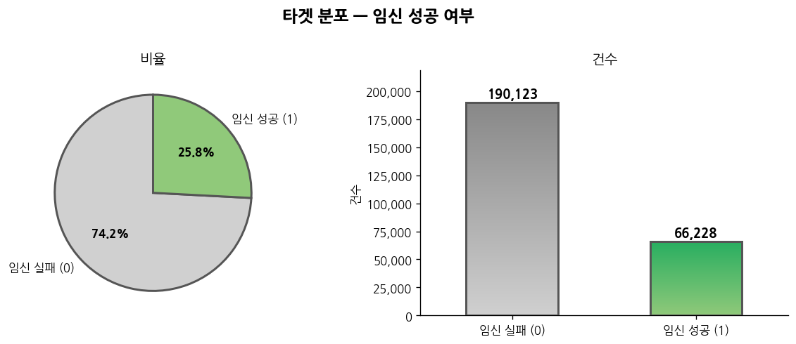

| 클래스 | 건수 | 비율 |
|--------|------|------|
| 임신 실패 (0) | 190,123 | 74.2% |
| 임신 성공 (1) | 66,228 | 25.8% |
| **합계** | **256,351** | **100%** |

> ⚠️ 실패:성공 비율 약 3:1 클래스 불균형

---

### 컬럼 설명 및 결측률

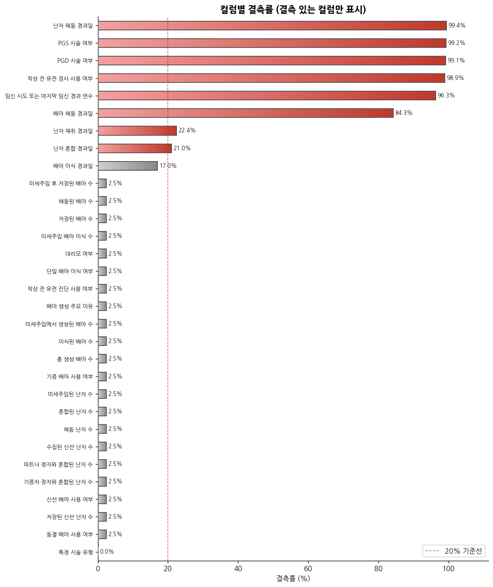

#### 기본 정보

| 컬럼명 | 설명 | 결측률 |
|--------|------|--------|
| ID | 고유 식별자 | 0% |
| 시술 시기 코드 | 시술이 진행된 시기 코드 | 0% |
| 시술 당시 나이 | 시술 시점의 환자 나이 | 0% |
| 임신 시도 또는 마지막 임신 경과 연수 | 임신 시도 기간 또는 마지막 임신 경과 연수 | 96.3% 🔴 |
| 시술 유형 | IVF 또는 DI | 0% |
| 특정 시술 유형 | 세부 시술 방법 분류 | 0% |

#### 시술 조건

| 컬럼명 | 설명 | 결측률 |
|--------|------|--------|
| 배란 자극 여부 | 배란 유도 약물 사용 여부 | 0% |
| 배란 유도 유형 | 배란 자극 프로토콜 유형 | 0% |
| 단일 배아 이식 여부 | 배아 1개만 이식했는지 여부 | 2.5% |
| 착상 전 유전 검사 사용 여부 (PGT-A) | 염색체 이상 선별 검사 시행 여부 | 98.9% 🔴 |
| 착상 전 유전 진단 사용 여부 (PGT-M) | 특정 유전 질환 진단 검사 시행 여부 | 2.5% |

#### 불임 원인

| 컬럼명 | 설명 | 결측률 |
|--------|------|--------|
| 남성 주/부 불임 원인 | 남성 측 주요/부수적 불임 원인 | 0% |
| 여성 주/부 불임 원인 | 여성 측 주요/부수적 불임 원인 | 0% |
| 부부 주/부 불임 원인 | 부부 공통 주요/부수적 불임 원인 | 0% |
| 불명확 불임 원인 | 원인 불분명 | 0% |
| 불임 원인 - 난관 질환 외 8개 | 세부 불임 원인 플래그 | 0% |

#### 시술 이력

| 컬럼명 | 설명 | 결측률 |
|--------|------|--------|
| 총 시술 횟수 | 전체 시술 횟수 | 0% |
| 클리닉 내 총 시술 횟수 | 동일 클리닉 시술 횟수 | 0% |
| IVF/DI 시술 횟수 | 각 시술 유형별 횟수 | 0% |
| 총 임신/출산 횟수 | 임신 및 출산 이력 | 0% |
| IVF/DI 임신/출산 횟수 | 시술 유형별 임신/출산 이력 | 0% |
| 배아 생성 주요 이유 | 배아 생성의 주된 목적 | 2.5% |

#### 배아 및 난자 정보

| 컬럼명 | 설명 | 결측률 |
|--------|------|--------|
| 총 생성 배아 수 | 이번 시술에서 생성된 전체 배아 수 | 2.5% |
| 이식된 배아 수 | 자궁에 실제로 이식된 배아 수 | 2.5% |
| 저장된 배아 수 | 냉동 보관된 배아 수 | 2.5% |
| 미세주입된 난자 수 | ICSI 시술에 사용된 난자 수 | 2.5% |
| 미세주입에서 생성된 배아 수 | ICSI를 통해 생성된 배아 수 | 2.5% |
| 미세주입 배아 이식/저장 수 | ICSI 배아 중 이식/저장된 수 | 2.5% |
| 해동된 배아/난자 수 | 해동하여 사용한 배아/난자 수 | 2.5% |
| 수집된 신선 난자 수 | 채취된 신선 난자 수 | 2.5% |
| 저장된 신선 난자 수 | 냉동 보관된 신선 난자 수 | 2.5% |
| 혼합된 난자 수 | 정자와 수정을 시도한 난자 수 | 2.5% |
| 파트너/기증자 정자와 혼합된 난자 수 | 출처별 수정 시도 난자 수 | 2.5% |

#### 난자 및 정자 출처

| 컬럼명 | 설명 | 결측률 |
|--------|------|--------|
| 난자 출처 | 본인 난자 / 기증 난자 여부 | 0% |
| 정자 출처 | 파트너 정자 / 기증 정자 여부 | 0% |
| 난자 기증자 나이 | 난자 기증자의 나이 | 0% |
| 정자 기증자 나이 | 정자 기증자의 나이 | 0% |
| 동결/신선/기증 배아 사용 여부 | 배아 출처 및 상태 | 2.5% |
| 대리모 여부 | 대리모를 통한 시술 여부 | 2.5% |
| PGD/PGS 시술 여부 | 착상 전 유전 진단/선별 시행 여부 | 99.1% 🔴 |

#### 경과일 정보

| 컬럼명 | 설명 | 결측률 |
|--------|------|--------|
| 난자 채취 경과일 | 난자 채취 후 경과일 수 | 22.4% 🟡 |
| 난자 해동 경과일 | 난자 해동 후 경과일 수 | 99.4% 🔴 |
| 난자 혼합 경과일 | 난자와 정자 혼합 후 경과일 수 | 21.0% 🟡 |
| 배아 이식 경과일 | 배아 이식 후 경과일 수 (5일차 = 배반포기) | 17.0% 🟡 |
| 배아 해동 경과일 | 배아 해동 후 경과일 수 | 84.3% 🔴 |

> 🔴 결측률 80% 이상 — 제거 또는 신중한 처리 필요  
> 🟡 결측률 17~25% — 결측 지시 변수 추가 고려

#### 타겟 변수

| 컬럼명 | 설명 |
|--------|------|
| 임신 성공 여부 | 0 = 임신 실패, 1 = 임신 성공 |

---

## 🩺 도메인 지식 & EDA 검증

의학적 근거를 먼저 제시하고, 실제 데이터에서도 동일한 패턴이 관찰되는지 확인합니다.  
이 근거들은 이후 전처리와 피처 엔지니어링 설계의 직접적인 basis가 됩니다.

---

### 1. 연령

35세를 기점으로 성공률이 급격히 하락합니다. 난자의 질과 수가 나이에 따라 감소하기 때문입니다.

| 연령대 | 생존 출산율 (LBR) |
|--------|-----------------|
| 30세 미만 | 51.12% |
| 30~34세 | 43.86% |
| 35~37세 | 41.64% |
| 38~40세 | 25.67% |
| 40~43세 | 15.58% |
| 44~50세 | 4.78% |

> 📄 Fertility and Sterility 메타분석 (11,335건): 35세 미만이 35세 이상보다 출산율 유의미하게 높음 (OR=1.29) — [링크](https://www.fertstert.org/article/S0015-0282(23)00169-3/fulltext)  
> 📄 4,958명 후향적 분석: 연령별 LBR 급격한 감소 수치 확인 — [링크](https://www.ncbi.nlm.nih.gov/pmc/articles/PMC6965061/)

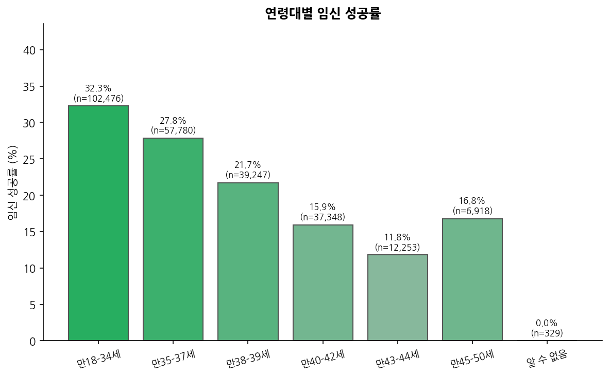

📊 **데이터 확인**: 만 18~34세 32.3% → 만 43~44세 11.8%로 급격히 감소 ✅  
시술 횟수, 난자 출처, 단일 배아 이식 여부 등 다른 범주형 변수도 도메인 지식과 일관된 방향으로 나타납니다.

---

### 2. 배아 이식 경과일

5일차(배반포기) 이식이 4일차 대비 임신 성공률 1.9배 높습니다. 자궁 내막과의 동기화가 더 잘 이루어지기 때문입니다.

> 📄 3,681 사이클 코호트 연구: 5일차 이식이 4일차보다 1.9배, 난자 4개 이상 + 2개 이식 시 2.5배 향상 — [링크](https://www.ncbi.nlm.nih.gov/pmc/articles/PMC12249899/)  
> 📄 Cochrane Collaboration 분석: 5일차 이식이 임신율과 생존율 모두 높게 나타남 — [링크](https://int.livhospital.com/5-day-old-embryo/)

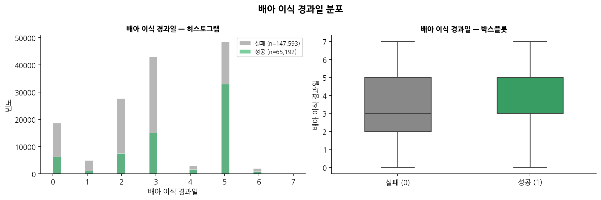

📊 **데이터 확인**: 배아 이식 경과일 히스토그램에서 성공군(초록)의 5일차 비율이 실패군보다 뚜렷하게 높음 ✅  
총 생성 배아 수, 수집된 신선 난자 수도 성공군 중앙값이 실패군보다 높게 나타납니다.

---

### 3. 기증 난자 사용

환자 나이보다 실제 사용된 난자의 나이가 성공률에 더 결정적입니다.

| 구분 | 44세 이상 성공률 |
|------|----------------|
| 본인 난자 | 3.5% |
| 기증 난자 | 27.5% |

> 📄 HFEA 데이터 분석: 44세 이상에서 기증 난자 사용 시 7배 이상 차이 — [링크](https://www.americansurrogacy.com/parents/IVF-success-rates-donor-eggs)

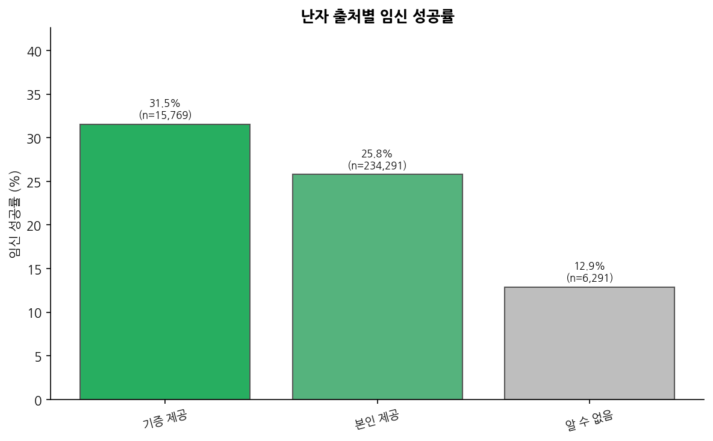

📊 **데이터 확인**: 기증 난자 31.5% > 본인 난자 25.8% ✅

---

### 4. 총 생성 배아 수 및 수집된 난자 수

배아 수가 많을수록 고품질 배아 선택 폭이 넓어져 성공률이 높아집니다. 최적 난자 수는 12~18개입니다.

> 📄 Fertility and Sterility 국가 데이터셋: 난자 수 증가에 따라 수정란·배반포·누적 LBR 선형 증가 — [링크](https://www.fertstert.org/article/S0015-0282(23)00004-3/fulltext)  
> 📄 Reproductive BioMedicine Online 체계적 문헌고찰: 최적 난자 수 12~18개 — [링크](https://www.rbmojournal.com/article/S1472-6483(20)30573-3/fulltext)

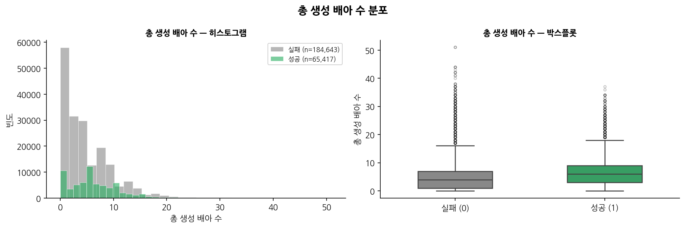
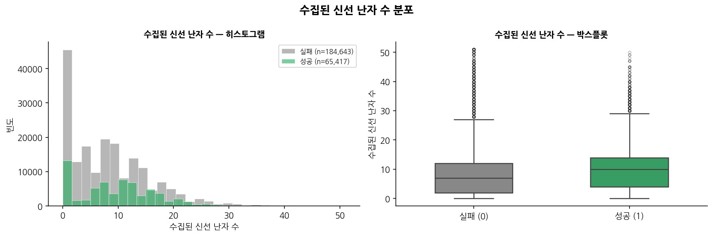

📊 **데이터 확인**: 총 생성 배아 수, 수집된 신선 난자 수 모두 성공군 중앙값이 실패군보다 높음 ✅

---

### 5. 시술 반복 실패 이력

실패 횟수가 많을수록 착상률이 유의미하게 낮아집니다.

| 이전 실패 횟수 | 착상률 |
|--------------|--------|
| 0회 | 45.8% |
| 1회 | 35.9% |
| 2회 | 31.2% |
| 3회 이상 | 21.0% |

> 📄 13,172명 코호트 연구 (16,975 사이클): 실패 횟수 증가에 따른 착상률 유의미한 감소 (p<0.001) — [링크](https://pmc.ncbi.nlm.nih.gov/articles/PMC7939155/)

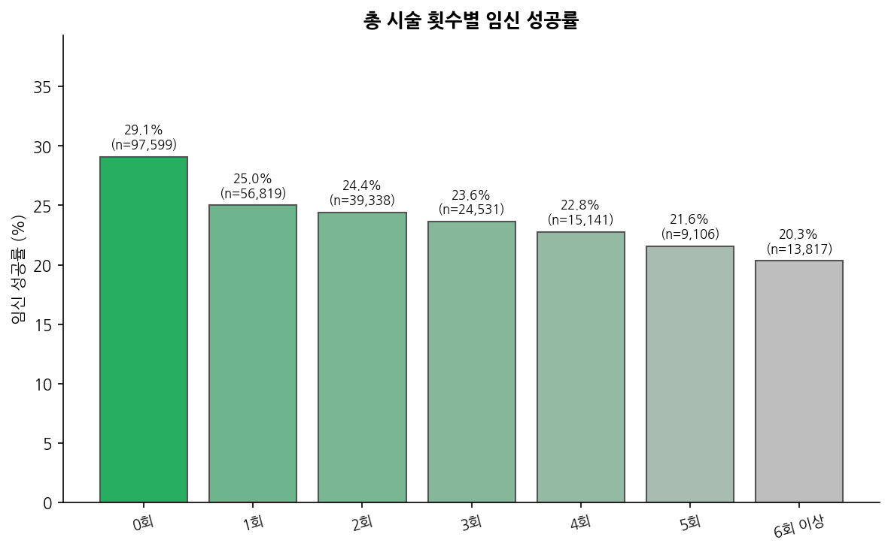

📊 **데이터 확인**: 총 시술 횟수 0회(29.1%) → 6회 이상(20.3%)으로 반복할수록 성공률 감소 ✅

---

### 추가 발견 — 상관관계 분석

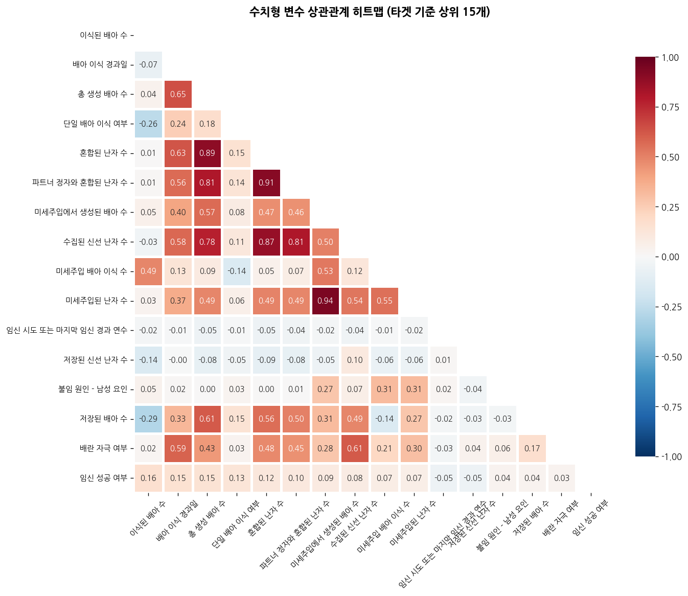

난자·정자 관련 변수들이 강한 군집을 형성합니다 (0.87~0.94). 다중공선성 주의가 필요합니다.

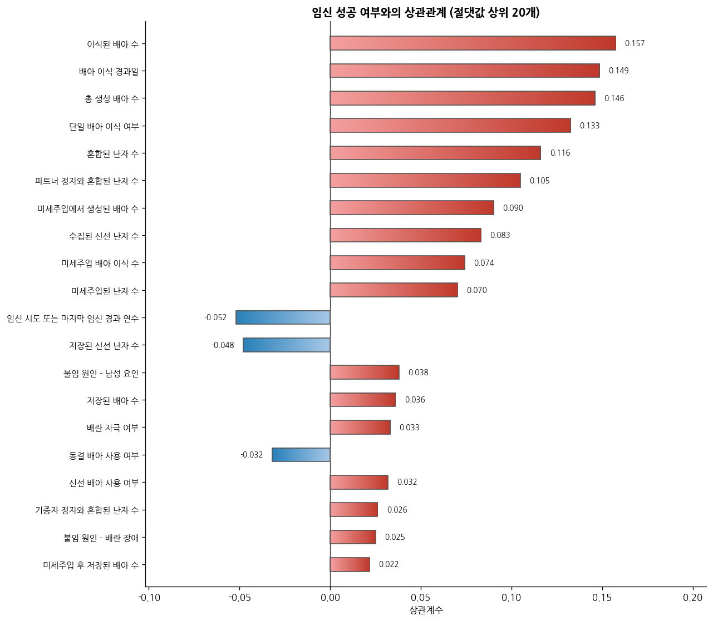

임신 성공과 가장 강한 양의 상관관계: **이식된 배아 수(+0.157)** > **배아 이식 경과일(+0.149)** > **총 생성 배아 수(+0.146)**

---

## ⚙️ 전처리 비교

| 처리 항목 | 김창현 | 박진영 | 정은혜 | 도메인 근거 |
|-----------|------|------|------|------|
| 고결측 변수 제거 | 결측률 80% 이상 6개 컬럼 제거 | `임신 시도 경과 연수` 1개만 제거 | `임신 시도 경과 연수` 1개만 제거 | — |
| 결측 indicator | 중간 결측 3개 컬럼만 추가 | 결측 보유 30개 전체 컬럼에 `_missing` 추가 | 없음 | — |
| 결측 시그니처 | 없음 | `nan_count`, `ivf_nan_count`, `embryo_nan_count`, `genetic_nan_count` 4개 추가 | 없음 | — |
| 배아/난자 결측 처리 | MICE 보간 | 0으로 대체 | 0으로 대체 | **총 생성 배아 수** — 배아/난자 변수 간 강한 상관관계(0.87~0.94)를 활용해 정교하게 추정 |
| DI 시술 결측 처리 | DI 시술 시 배아/난자 14개 컬럼 0으로 처리 | 없음 | 없음 | **총 생성 배아 수** — DI는 체외수정이 없으므로 해당 컬럼이 의미 없음 |
| 도메인 플래그 추가 | `배반포기_이식` (경과일 == 5) | 없음 | 없음 | **배아 이식 경과일** — 5일차 이식이 4일차 대비 성공률 1.9배 높음 |
| 횟수 컬럼 변환 | `'0회'~'6회 이상'` → 0~6 정수 매핑 | `'0회'~'6회 이상'` → 0~6, `Unknown` → -1 매핑 | `Unknown` → 그대로 유지 후 LabelEncoding | — |
| 연령 변환 | 연령 구간 → 순서형 정수 매핑 | 연령 구간 → 순서형 정수 매핑 | 연령 구간 → 수치형 중간값 매핑 (만18-34세→26, 만45-50세→47.5) | **연령** — 연속적 나이 값이 성공률 감소 패턴 반영 |
| 기증자 나이 변환 | 연령 구간 → 정수 매핑 | 연령 구간 → 정수 매핑 | 없음 | **기증 난자 사용** — 기증자 나이 자체가 성공률에 영향 |
| 범주형 인코딩 | LabelEncoding (7개 컬럼) | LabelEncoding | LabelEncoding (`Unknown` 포함) | — |

---

## 🔧 피처 엔지니어링 비교

| 파생 변수 카테고리 | 김창현 | 박진영 | 정은혜 | 도메인 근거 |
|-----------|------|------|------|------|
| 연령 관련 | `연령_그룹`, `연령_x_시술횟수`, `연령_x_이식배아수`, `연령_x_생성배아수` | `고령_38이상`, `고령_40이상`, `초고령_43이상` | 없음 (수치형 변환으로 대체) | **연령** — 35세, 38세, 40세, 43세 기점으로 성공률 급격히 하락 |
| 배아/난자 효율 | `배아_이식률`, `배아_저장률`, `난자_수정률`, `미세주입_성공률`, `신선_난자_활용률` | `신선난자_배아효율`, `혼합난자_배아효율`, `난자_혼합률`, `파트너정자_비율`, `이식_비율`, `배아_여유`, `파이프_효율`, `배아_손실수` | `배아_이식_효율` (이식된 배아 수 / 총 생성 배아 수) | **총 생성 배아 수** — 배아/난자 수 대비 실제 활용 효율이 성공률에 영향 |
| 출산 성공률 이력 | `임신_성공률_이력`, `출산_성공률_이력` | `반복실패_여부`, `실패경험_수`, `유산경험_수`, `과거_시술성공률` | `전체_출산_성공률` (총 출산 / 총 임신), `IVF_출산_성공률` | **시술 반복 실패 이력** — 실패 3회 이상 시 착상률 21%로 급락 |
| 이식 시기 | 없음 | `이식_분할기` (2~3일차), `이식_포배기` (5일차 이상), `배양_기간` | 없음 | **배아 이식 경과일** — 5일차 이식이 성공률 1.9배 높음 |
| 실효 난자 나이 | 없음 | `실효_난자_나이`, `고령_기증난자_상쇄` | 없음 | **기증 난자 사용** — 환자 나이보다 실제 사용된 난자의 나이가 성공률에 결정적 |
| 기증 여부 | 없음 | `기증난자_사용`, `기증정자_사용` | 없음 | **기증 난자 사용** — 기증 여부 자체가 성공률에 유의미한 영향 |
| 출산/임신 경험 | 없음 | `경산부`, `임신경험` | 없음 | **시술 반복 실패 이력** — 과거 임신/출산 경험이 착상 환경에 영향 |
| 시간 간격 | 없음 | `혼합_이식_간격`, `해동_이식_간격`, `난자해동_혼합_간격` | 없음 | **배아 이식 경과일** — 시술 단계별 시간 간격이 배아 품질에 영향 |
| **총 파생 변수 수** | **11개** | **28개** | **3개** | |

---

## 🧠 모델링 전략

### 공통 전략

**1. Transformer 도입 배경**

**트리 모델의 한계**
- 트리는 피처를 하나씩 독립적으로 분기 → 피처 간 복잡한 상호작용을 분기의 근사로만 표현
- 예: `연령 × 배아 이식 경과일 × 기증 난자 여부`가 동시에 조합될 때의 패턴을 트리는 각 피처를 순서대로 분기하여 근사할 뿐, 세 피처의 joint 관계를 직접 모델링하지 못함
- 난임 데이터는 도메인 지식에서 확인했듯 피처 간 상호작용이 임신 성공 여부를 결정하는 핵심 요인

**FT-Transformer를 선택한 이유**
- 각 피처를 독립 토큰으로 변환 → self-attention으로 모든 피처 쌍의 관계를 동시에 학습
- 기존 MLP는 피처를 단순 concatenate → 피처 순서에 민감하고 상호작용 포착이 제한적
- FT-Transformer는 피처 순서와 무관하게 어떤 피처 조합이든 관계를 직접 학습 가능
- 태뷸러 데이터에서 트리 계열에 필적하는 성능으로 검증된 아키텍처 (Revisiting Deep Learning Models for Tabular Data, NeurIPS 2021)

---

**2. 클래스 불균형 대응**

임신 실패(0) : 임신 성공(1) = 3:1 불균형. 보정하지 않으면 모델이 다수 클래스에 편향되어 소수 클래스의 패턴을 제대로 학습하지 못합니다.

- 트리 모델: `class_weight='balanced'` 또는 `scale_pos_weight=ratio` — 소수 클래스 샘플에 더 높은 가중치 부여
- 딥러닝 모델: `pos_weight=3.0` — BCEWithLogitsLoss에 양성 클래스 가중치 3배 적용
- 평가 지표: ROC-AUC — 임계값과 무관하게 클래스 불균형의 영향을 받지 않는 지표

---

### 김창현 — 모델 다양성 + 10-Fold OOF 스태킹

**CV 전략**

10-Fold Stratified K-Fold + OOF 앙상블을 사용했습니다.

10-Fold를 선택한 이유:
- 256,351개 대용량 데이터에서 fold 수가 적으면 검증 셋이 너무 커져 학습 데이터가 줄어듦
- 10-Fold로 학습 데이터를 최대한 활용하면서 안정적인 평가 가능

OOF 예측값을 메타 피처로 사용하는 이유:
- 각 샘플이 학습에 사용되지 않은 fold에서 예측되므로 데이터 누수가 없음
- 전체 훈련 데이터의 예측값을 만들 수 있어 스태킹 메타 모델 학습에 활용 가능
- 단순 hold-out 대비 분산이 낮고 안정적인 평가 가능

**트리 모델 튜닝**
- Optuna TPE Sampler로 50 trial 하이퍼파라미터 탐색
- 탐색 범위: learning_rate, num_leaves, min_child_samples, subsample, colsample_bytree, reg_alpha, reg_lambda
- seed42 단일 학습

**딥러닝 모델**
- FT-Transformer: rtdl 라이브러리 활용, 수치형/범주형 피처 분리 처리, seed42 단일
- SAINT: column attention + intersample attention 직접 구현, batch_size=256으로 메모리 최적화, seed42 단일

**스태킹**
- 5개 모델 OOF를 메타 피처로 → 10-Fold 로지스틱 회귀로 최적 가중치 자동 학습
- Nelder-Mead 대비 CV 기반이므로 과적합 위험 낮음

| 모델 | CV ROC-AUC |
|------|-----------|
| LightGBM | 0.7402 |
| XGBoost | 0.7404 |
| CatBoost | 0.7402 |
| FT-Transformer | 0.7398 |
| SAINT | 0.7390 |
| **스태킹** | **0.7420** |

---

### 박진영 — 가중치 최적화 + 10-Fold OOF 앙상블

**CV 전략**

10-Fold Stratified K-Fold + OOF 앙상블을 사용했습니다. 2-way 베이스라인에서 3-way로 점진적으로 확장하며 최적 조합을 탐색했습니다.

**ResNet-MLP를 추가한 이유**
- FT-Transformer와 같은 딥러닝이지만 학습 방식이 다름
- skip connection으로 그래디언트 소실 방지 → 더 깊은 피처 추출 가능
- AdamW + CosineAnnealingLR + Early Stopping으로 학습 안정성 확보
- FTT와 오류 패턴이 달라 앙상블 다양성에 추가 기여

**3단계 가중치 탐색 이유**
- 단순 균등 가중치보다 최적화된 가중치가 성능이 높음
- Coarse → Fine → Nelder-Mead 순서로 탐색 범위를 좁혀가며 효율적으로 최적값 도달
- 10개 랜덤 초기값으로 Nelder-Mead를 반복 → 로컬 최적에 빠지는 위험 감소

| 단계 | 방법 | 탐색 범위 |
|------|------|---------|
| 1단계 | Coarse Grid | Cat 0.3~0.8, FT 0.1~0.6, 간격 0.1 |
| 2단계 | Fine Grid | 최적 주변 ±0.08, 간격 0.02 |
| 3단계 | Nelder-Mead | 10개 초기값으로 연속 최적화 |

| 조합 | 리더보드 |
|------|---------|
| CatBoost + FT 2-way | 0.7421 |
| CatBoost + FT + ResNet-MLP 3-way | **0.7421** |

---

### 정은혜 — 베이스라인 탐색 전략

**CV 전략**

80:20 단순 Hold-out split을 사용했습니다. RandomForest → LightGBM → Optuna 튜닝 → CatBoost 앙상블 순서로 다양한 베이스라인을 빠르게 탐색했습니다.

**모델 탐색 과정**
- RandomForest (기본) → ROC-AUC 0.6862
- LightGBM (기본) → ROC-AUC 0.7160
- LightGBM + Optuna 튜닝 (20 trial) → ROC-AUC 0.7319
- LightGBM + CatBoost 가중 앙상블 (0.6:0.4) → **ROC-AUC 0.7324**

**하이퍼파라미터 탐색 범위**
- n_estimators, learning_rate, max_depth, num_leaves, subsample, colsample_bytree
- `scale_pos_weight=ratio`로 클래스 불균형 대응

---

## 📈 모델 결과

### 김창현 — 베이스 모델 성능 및 Feature Importance 분석

#### 베이스 모델 성능

| 모델 | CV ROC-AUC |
|------|-----------|
| LightGBM | 0.7402 |
| XGBoost | 0.7404 |
| CatBoost | 0.7402 |
| FT-Transformer | 0.7398 |
| SAINT | 0.7390 |
| **스태킹 (최종)** | **0.7420** |

---

#### ROC-AUC 곡선

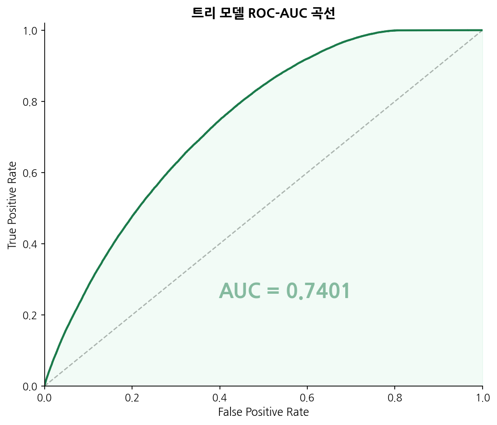

LightGBM, XGBoost, CatBoost 세 트리 모델은 모두 AUC 0.740~0.741 수준으로 유사한 판별력을 보였습니다. 세 모델이 거의 동일한 곡선을 그리는 만큼 단일 트리 모델만으로는 성능 한계가 있음을 확인할 수 있습니다.

FT-Transformer(0.7393)와 SAINT(0.7386)는 트리 모델 대비 소폭 낮은 AUC를 기록했습니다. 그러나 Feature Importance에서 확인했듯 트리 모델과 서로 다른 피처를 중요하게 학습하므로, 앙상블 시 상호 보완적인 역할을 합니다.

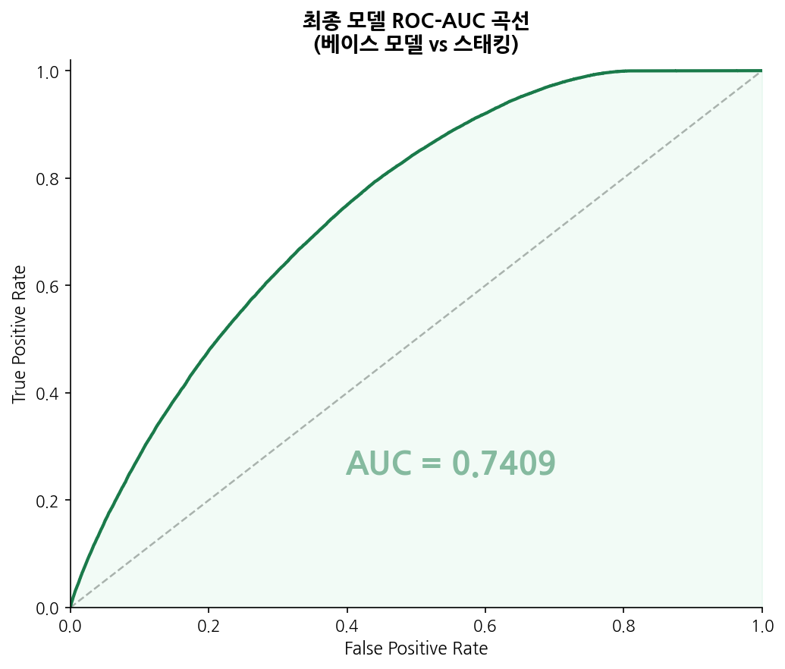

5개 베이스 모델의 OOF 예측값을 메타 피처로 로지스틱 회귀 스태킹을 적용한 결과, AUC 0.7409로 개별 모델 대비 성능이 향상되었습니다. 트리와 딥러닝이 서로 다른 패턴을 학습한 덕분에 스태킹이 효과적으로 작동한 결과입니다.

---

#### 트리 모델 Feature Importance

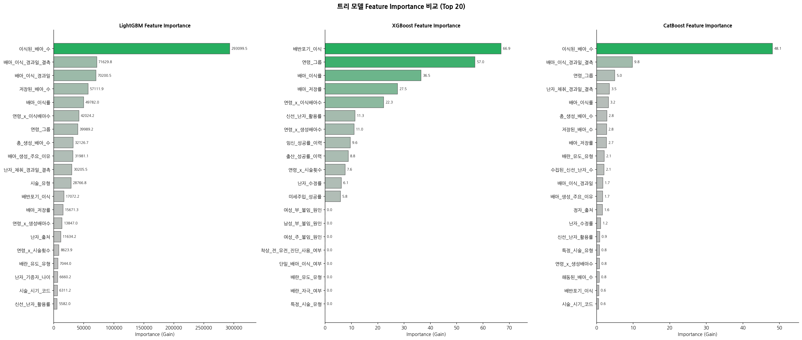

**LightGBM**에서는 `이식된_배아_수`가 압도적으로 높은 importance를 기록했습니다 (293,099). 그 뒤를 `배아_이식_경과일_결측`, `배아_이식_경과일`, `저장된_배아_수` 순으로 이었습니다. 도메인 지식에서 확인했던 배아 이식 시기와 배아 수의 중요성이 데이터에서도 그대로 드러납니다.

**XGBoost**는 `배반포기_이식` (66.9)을 가장 중요한 피처로 꼽았습니다. 5일차 이식 여부를 나타내는 도메인 플래그가 단독으로 가장 높은 gain을 기록한 것으로, 배반포기 이식의 의학적 우위가 모델에서도 핵심 분기 기준이 됨을 확인할 수 있습니다. `연령_그룹` (57.0)이 그 다음으로 높아 연령 역시 강력한 예측 변수임을 보여줍니다.

**CatBoost**는 `이식된_배아_수` (48.1)와 `배아_이식_경과일_결측` (9.8)을 주요 피처로 선정했습니다. 세 트리 모델 모두 배아 이식 관련 변수와 연령 관련 파생 변수를 일관되게 높게 평가했습니다.

---

#### 딥러닝 모델 Feature Importance

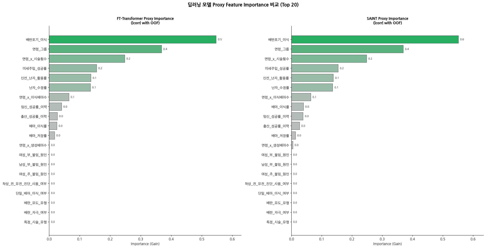

**FT-Transformer**와 **SAINT** 모두 `배반포기_이식` (각각 0.5, 0.6)을 가장 중요한 피처로 꼽았습니다. 트리 모델에서 XGBoost만이 `배반포기_이식`을 1위로 선정했던 것과 달리, 딥러닝 모델은 두 모델 모두 이 피처를 압도적 1위로 평가했습니다.

`연령_그룹` (0.4), `연령_x_시술횟수` (0.2) 등 연령 관련 파생 변수도 상위권을 차지했습니다. 반면 트리 모델에서 높은 중요도를 보인 `이식된_배아_수` 같은 수치형 변수는 딥러닝에서 상대적으로 낮게 평가되었습니다.

이는 FT-Transformer와 SAINT가 피처 간 상호작용(배반포기 이식 × 연령)을 attention 메커니즘으로 포착하면서, 단순 수치보다 도메인 지식 기반의 플래그 변수를 더 강한 신호로 학습했음을 시사합니다.

---

#### 트리 vs 딥러닝 — Feature Importance 비교

| 피처 | LightGBM | XGBoost | CatBoost | FTT | SAINT |
|------|---------|---------|---------|-----|-------|
| 이식된_배아_수 | 🥇 1위 | — | 🥇 1위 | — | — |
| 배반포기_이식 | 13위 | 🥇 1위 | — | 🥇 1위 | 🥇 1위 |
| 연령_그룹 | 7위 | 2위 | 3위 | 2위 | 2위 |
| 배아_이식_경과일 | 3위 | — | — | — | — |
| 미세주입_성공률 | — | — | — | 4위 | 4위 |

트리 모델과 딥러닝 모델이 서로 다른 피처를 중요하게 평가하는 경향이 뚜렷합니다. 트리는 연속형 수치(`이식된_배아_수`, `배아_이식_경과일`)에 강하게 반응한 반면, 딥러닝은 도메인 플래그(`배반포기_이식`)와 상호작용 피처(`연령_x_시술횟수`)를 더 중요하게 학습했습니다. 이 차이가 이종 앙상블의 성능 향상을 설명하는 핵심 근거입니다.